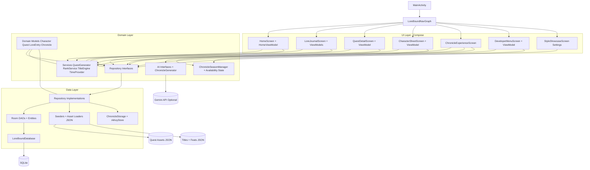

# LoreBound

LoreBound turns daily life into an RPG-style progression system with quests, character growth, a lore journal, and seasonal chronicle experiences.

## Architecture Diagram



## Product Ideology and Business Logic

- Deep dive: `docs/IDEOLOGY_AND_BUSINESS_LOGIC.md`
- Includes Mermaid decision-flow diagrams for quest refresh, generator logic, chronicle season gating, notifications, and tutorial visibility.
- Covers decision-making flows for quest generation, assignment/expiry, streaks, chronicle season gating, notifications, verification, and onboarding tutorials.

## Layers (Summary)

- **UI Layer**: Compose screens + ViewModels for presentation and interaction.
- **Domain Layer**: business logic, repository contracts, quest/chronicle/title systems, AI abstractions.
- **Data Layer**: Room, DAO/entity mapping, repository implementations, asset seeding, encrypted key storage.

## Project Structure

- App module docs and deeper feature details: `app/README.md`
- Core sources: `app/src/main/java/com/pauls/lorebound/`
- JSON assets: `app/src/main/assets/`

## Build

```powershell
cd C:\Users\z004wujn\AndroidStudioProjects\LoreBound
.\gradlew.bat assembleDebug
```

APK output:

- `app/build/outputs/apk/debug/LoreBound.apk`
